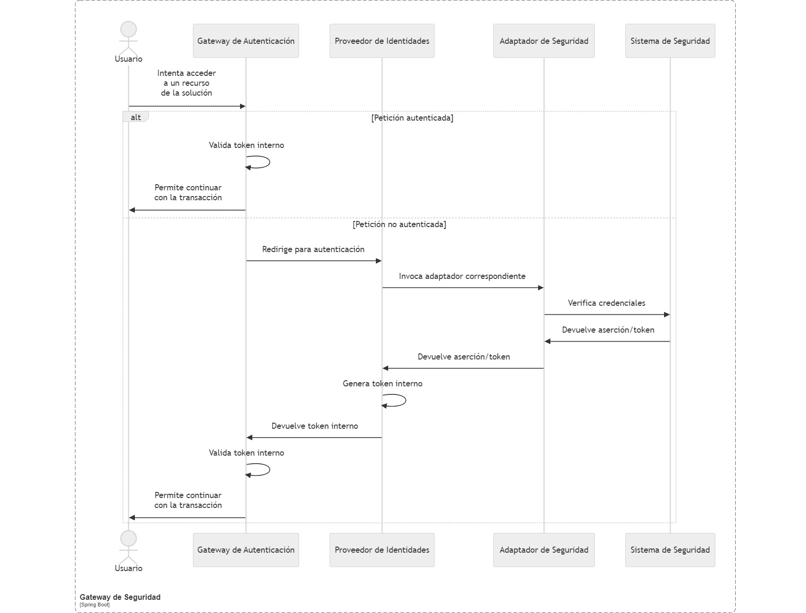

# Definición de Arquitectura del Sistema para Combatir el Hurto de Vehículos

[[_TOC_]]

## Portada

### Participantes
<table border="1">
    <thead>
        <tr>
            <th>Rol</th>
            <th>Nombre</th>
            <th>Correo</th>
        </tr>
    </thead>
    <tbody>
        <tr>
            <td>Coach Técnico</td>
            <td>Duval Ledesma</td>
            <td>duval.ledesma@ceiba.com.co</td>
        </tr>
    </tbody>
</table>

### Palabras Clave o Etiquetas (Tags)

Placa
Entidades Policiales
Dispositivos de monitoreo
Hurto

## 1. Introducción y Objetivos

El Sistema para Combatir el Hurto de Vehículos pretende ser una herramienta de apoyo a las entidades policiales de varios países proporcionando información de los lugares más frecuentes de hurto y las rutas más transitadas de le vehículos hurtados. Para cumplir con este objetivo se propone centralizar la información recopilada por dispositivos de monitoreo de tráfico instalado en puntos estratégico de las principales ciudades así como las bases de datos de vehículos hurtados que disponen las entidades policiales de las países adscritos para la utilización del sistema.

El prinicipal objetivo de la solución es almacenar y gestionar la información enviada por los dispositivos de monitoero así como las bases de datos de vehículos robados que posean las Entidades Policiales de cada ciudad adscrita.

### 1.1. Resúmen de Requisitos

* Recibir los eventos capturados por los dispositivos de monitoreo de tránsito en una base de datos consolidada.
  
* Centralizar las base de datos de vehículos robados que disponen las entidades policiales de cada país que adscriba a la solución.
  
* Proveer de una interfaz de consulta de vehículos por matrícula y generar un listado de eventos en los que se ha sido identificado; la interfaz deberá ser capaz de mostrar la información de eventos en una mapa.
  
* Identificar las zonas por las cuales mayormente transitan los vehículos hurtados.

* Indentificar zonas en donde se hayan producido la mayor cantidad de hurtos por ciudades.

### 1.2. Objetivos de Calidad

* Flexible.- Lo solución tiene la capacidad de ser escalada de manera controlada con la finalidad de mejorar su capacidad de procesamiento por incremento de dispositivos de monitoreo y/o ciudades adscritas que requiera mayor asignación de recursos.

* Protegido.- La solución propuesta garantiza que el envío de información desde los dispositivos de monitore así como también las consultas de la informacipon centralizada se realizarán en un entorno asegurado con mecanismos de autenticación y autorización.
  
* Operable.- Los componentes desarrollados deberan ser capaces de ser desplegados en las principales nubes privadas (Azuer, AWS, GCP), así como también en una arquitectura on premise de ser necesario.

### 1.3. Interesados

* Equipo de desarrollo.- El documento permitirá al Equipo de Desarrollo identificar las características del sistema, incluyendo los requerimientos funcionales y los no funcionales; de igual la integración entre los diferentes componentes de la solución.
  
* Equipo de Infraestructura.- Proporcionará una visión clara de cómo el sistema está diseñado para ser desplegado, monitoreado y mantenido en producción.
  
* Product Owner.- Será una herramienta clave para comprender las capacidades y limitaciones técnicas del sistema, permitiéndole tomar decisiones informadas sobre la priorización de funcionalidades y la planificación del roadmap del producto.
  
* Gerencia.- Permitirá evaluar si el proyecto se alinea con los objetivos estratégicos de la organización y si los recursos se están utilizando de manera eficiente.

* Entidades Policiales.- Las Entidades Policiales de las ciudades adscritas a la solución tecnológica podrán tener una visión de clara de las bondades del sistema y como el mismo podría servir de apoyo a la disminución de hurto de vehículos en sus respectivas localidades.
  
## 2. Restricciones

* Garantizar la operatividad continua de los dispositivos de monitoreo no forma parte del alcance del proyecto.
  
* El desarrollo de la solución no contempla por el momento la implementación de aplicaciones Android o iOS para dispositivos móviles.

## 3. Contexto y Alcance

### 3.1. Contexto de Negocio

  
  <table border="1">
    <th>Actor</th>
    <th>Entradas</th>
    <th>Salidas</th>
    <tr>
        <td>Entidades Policiales</td>
        <td>Datos de un nuevo vehículo hurtado</td>
        <td>Confirmación de regustro</td>
    </tr>
    <tr>
        <td>Entidades Policiales</td>
        <td>Identificación de vehículo</td>
        <td>Eventos relacionados al vehícullo</td>
    </tr>
    <tr>
        <td>Dispositivos de monitore</td>
        <td>Eventos capturados de vehículos </td>
        <td>Confirmación de registro</td>
    </tr>
    <tr>
        <td>Base Vehículos Hurtados</td>
        <td>Información masiva de vehículos hurtados</td>
        <td>Acceso a base consolidad de vehículos hurtados</td>
    </tr>
  </table>

### 3.2. Contexto Técnico

pendiente diagrama y descripcion

## 4. Estrategia de Solución

  Con la finalidad de atender los requerimientos funcionales de la solución, se plantea la implementación de los siguintes componentes:

  *  API de Integración.- Será una aplicación diseñada para funcionar con recursos limitados y que será instalada en los dispositivos de monitoreo; cuya única responsabilidad será la de enviar los eventos capturados hacia el repositorio centralizado de la solución.

  *  Gateway de Seguridad.- Con la finalidad de permitir que las entidades policiales puedan utilizar sus propios mecanismos de autenticación se prevee implementar un enfoque basa en delegación de autorización.

  *  Broker de Mensajería.- La finalidad de este componentes es desacoplar la API de Integración con el resto del sistema y ademas soportar la alta transaccionalidad que van a agenerar el creciente número de dispositivos de monitoreo adscritos a la solución. 
  
  *  Servicio de Transformación.- Componente encargado de recibir los mensajes enviados por la API de Integración a traves del broker de mensajería, convertir la información recibida en una estructura homogenia y persistir en el repositorio de almacenamiento selccionado.

  *  Repositorio Centralizado.- Se pretende utilizar un repositorio para centralizar la información de vehículos hurtados que tienen las entidades policiales de cada ciudad adscrita así como también los eventos capturados por los dispositivos de monitor; de igual manera se tendrá un repositorio para las fotografías de los eventos capturados.
   
  *  Api de Consulta.- Componente que permitirá consultar los eventos registrados de un véhiculo en la base de datos centralizada.
  
  *  Aplicación SPA.- Componente que permitirá visuaizar las eventos registrados de un véhiculo, permitiendo ademas que esta información se pueda visualizar en un mapa.
   
  *  Análisis de Datos.- Herramienta que permitirá obtener información estadísticas acera de hurto de vehículos y se podrán determinar zonas de tránsito habitual de los vehículos hurtados así como las zonas más peligrosas.

## 5. Vista Estática 
  
  

## 6. Vista Dinámica (Ejecución)

* API de Integración
  

  <table border="1">
    <th>Componente</th>
    <th>Descripción</th>
    <tr>
        <td>Api de Integración<t/d>
        <td>Aplicación responsable de enviar los eventos capturados y almacenados en los dispositivos de monitoreo hacia el repositorio centralizado de la solución.</td>
    </tr>
    <tr>
        <td>Dispositivo de monitoreo<t/d>
        <td>Equipos que monitorean el tránsito en las calles, cuentan con cámaras para la captura de las imágenes de los vehículos que transitan e internamente, cuenta con un componente que se encarga de reconocer las matrículas de los vehículos, esta información es almacenada en una base de datos SQLLite.</td>
    </tr>
    <tr>
        <td>Gateway de Seguridad<t/d>
        <td>Componente encargado de garantizar que el acceso a cada uno de los componentes de la solución se realice en un entorno seguro.</td>
    </tr>
    <tr>
        <td>Broker de Mensajería<t/d>
        <td>Permite recibir las datos publicados por la API de Integración instalada en cada dispositivo de monitoreo y entregar a los suscriptores para continuar con el proceso de almacenamiento.</td>
    </tr>
  </table>

* Gateway de Seguridad
  
  

  <table border="1">
    <th>Componente</th>
    <th>Descripción</th>
    <tr>
        <td>Usuario</td>
        <td>Funcionario de una de las Entidades Policiales que requiere realizar alguna acción en el sistema</td>
    </tr>
    <tr>
        <td>Gateway de Autenticación</td>
        <td>Punto de entrada de la solución, es responsable de autenticar y autorizar a los usuarios antes de permitirles acceder a los recursos protegidos</td>
    </tr>
    <tr>
        <td>Proveedor de Identidades</td>
        <td>Este componente actuará como intermediario entre el gateway de autenticación y los diferentes sistemas de autenticación de las entidades policiales</td>
    </tr>
    <tr>
        <td>Adaptador de Seguridad</td>
        <td>Para cada tipo de sistema de autenticación (LDAP, base de datos, servicio REST), se implementará un adaptador de autenticación específico. Estos adaptadores serán responsables de comunicarse con los sistemas de autenticación de las entidades policiales y verificar las credenciales de los usuarios</td>
    </tr>
    <tr>
        <td>Sistema de Seguridad</td>
        <td>Sistemas de Seguridad personalizado de cada entidad policial que será el encargado de validar las credenciales y/o mecanizmos de autenticación.</td>
    </tr>
  </table>

* API de Transformación
  
  

  <table border="1">
    <th>Componente</th>
    <th>Descripción</th>
    <tr>
        <td>Cola de Mensajes</td>
        <td>El Servicio de Transformación recibe un mensaje con los eventos remitidos desde un dispositivo de monitoreo a la cola de mensajes.</td>
    </tr>
    <tr>
        <td>API de Transformación</td>
        <td>El Servicio de Transformación es el componente principal que coordina el procesamiento del mensaje.</td>
    </tr>
    <tr>
        <td>Validador de Datos</td>
        <td>El Servicio de Transformación envía los datos del mensaje al Validador de Datos para verificar que cumplan con los requisitos definidos.</td>
    </tr>
    <tr>
        <td>Almacenamiento NoSQL</td>
        <td>Repositorio de almacenamiento NoSQl que contendrá la información general de las visualizaciones.</td>
    </tr>
    <tr>
        <td>Almacenamiento de Imágenes</td>
        <td>Repositorio de imágenes que contendrá las fotografías de las visualizaciones.</td>
    </tr>
  </table>

* API de Consulta
  
  

  <table border="1">
    <th>Componente</th>
    <th>Descripción</th>
    <tr>
      <td>Usuario</td>
      <td>El Usuario (entidad policial) envía una solicitud de consulta a la API de Consulta.</td>
    </tr>
    <tr>
      <td>Apliación SPA</td>
      <td>La Aplicación SPA es el punto de entrada para las consultas.</td>
    </tr>
    <tr>
      <td>Gateway de Seguridad</td>
      <td>Su responsabilidad es garantizar que las consultas se realicen en un entorno seguro.</td>
    </tr>
    <tr>
      <td>API de Consulta</td>
      <td>Se encarga de coordinar las consulta de información de un vehículo.</td>
    </tr>
    <tr>
      <td>Servicio de Consulta</td>
      <td>Procesa las solictudes de consulta de datos e imágenes.</td>
    </tr>
    <tr>
      <td>Almacenamiento NoSQL</td>
      <td>Devuelve los datos de las visualizaciones de un vehículo.</td>
    </tr>
    <tr>
      <td>Almacenamiento de imágenes</td>
      <td>Devuelve las fotos de las visualizaciones de un vehículo.</td>
    </tr>
  </table>
  
* Herramienta de Análisis de Datos

  

  <table border=""1>
    <th>Componente</th>
    <th>Descripción</th>
    <tr>
      <td>Usuario</td>
      <td>El Usuario (entidad policial) envía una petición de visualización.</td>
    </tr>
    <tr>
      <td>Kibana</td>
      <td>Kibana recibe la solicitud del usuario y consulta los datos agregados en Elasticsearch.</td>
    </tr>
    <tr>
      <td>Elasticsearch</td>
      <td>Elasticsearch busca y agrega los datos solicitados en sus índices y devuelve los datos agregados a Kiban</td>
    </tr>
    <tr>
      <td>Logstash</td>
      <td>Logstash transforma y carga los datos en Elasticsearch.</td>
    </tr>
    <tr>
      <td>Almacenamiento NoSQL</td>
      <td>envía los datos de las visualizaciones a Logstash de forma periódica.</td>
    </tr>
  </table>
  
## 7. Vista de Despliegue

## 8. Aspectos Transversales
  
* Para la implemenetación de los diferentes elementos que componen la solución se dara preferencia a la utilización de herramientas open source con la finalidad de evitar incurrir en gastos adocionales por concepto de licenciamiento.
  
* La solución debe ser capaz de escalar de manera sencilla para manejar un grán volúmen de datos y un número creciente de dispositivos de monitoreo y ciudades adscritas.

* Se debe garantizar un manejo eficiente para almacenar y recuperar grandes cantidades de imágenes.
  
* La información capturada por los dispositivos de monitoreo puede ser sensible, por lo que, la seguridad debe ser una prioridad en cada uno de los componentes de la solución.
 
### 8.1 Supuestos

* Los dispositivos de monitoreo pueden almacenar localmente en una base de datos SQLite los eventos capturados hasta por 24 horas, luego de este tiempo los eventos son eliinados para evitar saturar la capacidad de almacenamiento
  
* Se contará con acceso a los dispositivos de monitoreo para la instalación de la API de Integración.
  
* Se contará con el compromiso de las entidades policiales de cada una de las ciudades adscritas al servicio, para realizar la rotación de certificados de seguridad en los dispositivos de monitoreo con una frecuiencia anual o a demanda en casos específicos.

## 9. Decisiones de Arquitectura

* Despliegue de solución 

  Para el despliegue de la solución se utilizarán teconologpias que tenga un enfoque agnóstico a la infraestructura subyacente; con lo cual se garantiza la portabilidad entre nubes y der ser necesario incluso se podría desplegar un arquitectura on-promise.

  * Contenededores(Docker).- Empaquetar cada componente de la arquitectura en contenedores Docker es fundamental. Los contenedores Docker proporcionan un entorno de ejecución consistente, independientemente del sistema operativo o la infraestructura subyacente.
  
  * Orquestación de Contenedores (Kubernetes): Kubernetes es una plataforma de orquestación de contenedores que automatiza el despliegue, la gestión y el escalado de aplicaciones en contenedores. Kubernetes es compatible con la mayoría de las nubes públicas (AWS, Azure, GCP) y también se puede desplegar en entornos on-premise.
  
  Se considera que AWS es la mejor opción para el despliegue del proyecto por las siguientes razones:

  * Madurez y Amplitud de Servicios: AWS ofrece la gama más amplia de servicios, lo que brinda flexibilidad para elegir las herramientas que mejor se adapten a las necesidades del proyecto.
  
  * Escalabilidad: AWS ofrece una excelente escalabilidad para manejar grandes volúmenes de datos y tráfico, lo que es crucial para el proyecto considerando que se prevee ampliar la oferta a varios paises.
  
  * Experiencia: AWS tiene amplia experiencia en el manejo de grandes volúmenes de datos y aplicaciones de alto rendimiento, lo que genera confianza en la capacidad de la arquitectura para la solución propuesta.

* API de Integración
  
  Para la implementación de la API de Integración se debe tener en consideración la limitación de recursos de los dispositivos de monitore, con esta premisa se realiza un análisis comparativo de los principales leguajes de programación existentes en el mercado y que sirven para el propóosito de la solución:
  
  <table border="1">
    <th>Característica</th>
    <th>Java</th>
    <th>Python</th>
    <th>Node.js</th>
    <th>Go/th>
    <tr>
        <td>Versión</td>
        <td>21</td>
        <td>3.12</td>
        <td>20</td>
        <td>1.22</td>
    </tr>
    <tr>
        <td>Proceador</td>
        <td>Mínimo 1 GHz - recomendado multi-core </td>
        <td>Mínimo 1 GHz</td>
        <td>Mínimo 1 GHz</td>
        <td>Mínimo 1 GHz</td>
    </tr>
    <tr>
        <td>RAM mínimo</td>
        <td>1 GB</td>
        <td>512 MB</td>
        <td>512 MB</td>
        <td>256 MB</td>
    </tr>
    <tr>
        <td>RAM mínimo</td>
        <td>2 GB</td>
        <td>1 GB</td>
        <td>12 GB</td>
        <td>512 MB</td>
    </tr>
    <tr>
        <td>Espacio en disco</td>
        <td>200 MB</td>
        <td>100 MB</td>
        <td>100 MB</td>
        <td>50 MB</td>
    </tr>
    <tr>
        <td>Sistema operativo</td>
        <td>Multiplataforma</td>
        <td>Multiplataforma</td>
        <td>Multiplataforma</td>
        <td>Multiplataforma</td>
    </tr>
  </table>

  De acuerdo acuerdo a los resultados del análisis, se estbalece que se utiliza el lenguaje de programación [Go](https://go.dev/ "**Go**") para la implentación de la Api de Integración, ya que es conocido por su eficiencia en el uso de recuros y lo hace ideal para ser instalado en los dispositivos de monitoreo.

* Broker de mensajería

  El broker de mensajeería es crucial para la escalabilidad, fiabilidad y el rendimiento de la solución propuesta. Dentro de las opciones más populares y robustas del mercado se encuentra Kafka y RabbitMQ, realizaremos una análisis comparativo para tomar la mejor decisión:

  <table border="1">
    <th>Característica</th>
    <th>Kafka</th>
    <th>RabbitMQ</th>
    <tr>
        <td>Rendimiento</td>
        <td>Muy alto</td>
        <td>Alto</td>
    </tr>
    <tr>
        <td>Escalabilidad</td>
        <td>Altamente escalable</td>
        <td>Escalable</td>
    </tr>
    <tr>
        <td>Durabilidad</td>
        <td>Alta(almacenamiento en disco)</td>
        <td>Alta(persistencia opcional)</td>
    </tr>
    <tr>
        <td>Modelo</td>
        <td>Publicación-subscripción</td>
        <td>Enrutamiento flexible</td>
    </tr>
    <tr>
        <td>Transacciones</td>
        <td>No soporta transacciones</td>
        <td>Soporta transacciones</td>
    </tr>
    <tr>
        <td>Retención de mensajes</td>
        <td>Soporta</td>
        <td>No soporta</td>
    </tr>
    <tr>
        <td>Facilidad de uso</td>
        <td>Requiere mas configuración</td>
        <td>Fácil de configurar</td>
    </tr>
  </table

  Considerando los requisitos de integración con dispostivos de monitoreo, la Api de Integración necesita manejar un alto volúmen de mensajes y Kafka estadiseñado este tipo de carga de trabajo, por lo tanto será la opción recomendada como broker de mensajería.

* Almacenamiento

  Alineado con la idea de utilizar herramientas open source, se realizó el analisis de bases de datos populares con la finalidad de decidir por la que mas le conviene al proyecto:

  <table border="1">
    <th>Característica</th>
    <th>MySql</th>
    <th>PosgreSQL</th>
    <th>MongoDB</th>
    <tr>
        <td>Tipo de base de datos</td>
        <td>Relacional(SQL)</td>
        <td>Relacional(SQL)</td>
        <td>NoSQL(Documentos)</td>
    </tr>
    <tr>
        <td>Modelo de datos</td>
        <td>Tablas con filas y columnas</td>
        <td>Tablas con filas y columnas</td>
        <td>Documentos en formato BSON (esquema flexible)</td>
    </tr>
    <tr>
        <td>Consultas</td>
        <td>SQL</td>
        <td>SQL (soporta consultas avanzadas y funciones)</td>
        <td>Consultas basadas en documentos (JSON-like)</td>
    </tr>
    <tr>
        <td>Transacciones</td>
        <td>Soporta ACID</td>
        <td>Soporta ACID</td>
        <td>Soporte limitado para transacciones ACID</td>
    </tr>
    <tr>
        <td>Escalabilidad</td>
        <td>Limitada (requiere sharding para escalabilidad horizontal)</td>
        <td>Buena (soporte nativo para particionamiento y escalabilidad vertical)</td>
        <td>Excelente (diseñado para escalabilidad horizontal)</td>
    </tr>
    <tr>
        <td>Rendimiento</td>
        <td>Alto rendimiento para transacciones OLTP</td>
        <td>Alto rendimiento especialmente en consultas complejas y análisis de datos</td>
        <td>Alto rendimiento en operaciones de lectura y escritura, especialmente con documentos grandes</td>
    </tr>
    <tr>
        <td>Casos de uso</td>
        <td>Aplicaciones OLTP, sistemas de gestión de contenido, aplicaciones web</td>
        <td>Aplicaciones OLTP, sistemas de información geográfrica, aplicaciones científicas, análisis de datos</td>
        <td>Aplicaciones que requieren flexibilidad de esquema, almacenamiento de datos no estructurados, prototipo rápido y aplicaciones en tiempo real</td>
    </tr>
  </table>

  Dado que la solución debe garantizar una alta escalabilidad y soportar el manejo de información heterogenia se recomienda utilizar **MongoDb** en contenedores o DBaaS como repositorio de datos para el proyecto, garantizando una alta disponibilidad y escalabilidad.

  En cuanto al repositorio para imágenes y en concordancia con la decisión de desplegar la solución en AWS se propone utilizar **AWS S3**

* Herramienta de Análisis de Datos

  * Búsqueda Rápida y Eficiente.- Elasticsearch es un motor de búsqueda y análisis distribuido basado en Apache Lucene. Está diseñado para indexar y buscar grandes volúmenes de datos en tiempo real. Su capacidad para realizar búsquedas rápidas es crucial para analizar los datos obtenidos desde los dispositivos de monitoreo y encontrar patrones de tránsito de los vehículos hurtados, zonas donde mas hurtos se producen y otros eventos relevantes.
  
  * Visualización de Datos.- Kibana es una herramienta de visualización de datos que se integra perfectamente con Elasticsearch. Permite crear dashboards interactivos, gráficos y mapas que facilitan la comprensión de los datos recuperados desde los dispositivos de monitoreo.

## 10. Requerimientos de Calidad

### 10.1. Requerimientos de Calidad

## 11. Riesgos y Deuda Técnica

### 11.1 Riesgos identificados

### 11.2 Deuda Técnica Identificada